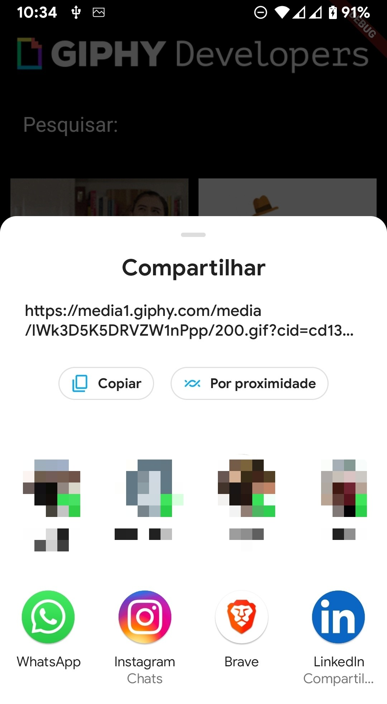

# buscador de gif

Um aplicativo feito em flutter para buscar e compartilhar GIFS consumindo a API do site GIPHY.
Para a construção desse projeto segui as orientações do curso da Udemy "Criação de Apps Android/iOS/Web com Flutter - 4 cursos em 1"

## 🖼️ Imagens

 

    
    
    
 

### ⚙ Features

- [x] Busca de gif por nome
- [x] Compartilhamento de gif

### 📦 Pacotes

- [arm_64_v8a](https://github.com/fabriciolima77/buscador_gif/blob/master/APK/app-arm64-v8a-release.apk)
- [armeabi_v7a](https://github.com/fabriciolima77/buscador_gif/blob/master/APK/app-armeabi-v7a-release.apk)

### 🛠 Tecnologias

As seguintes ferramentas foram usadas na construção do projeto:

- [Dart](https://dart.dev/)
- [Flutter](https://flutter.dev/)
- [transparent_image 2.0.0](https://pub.dev/packages/transparent_image/install)
- [share 2.0.4](https://pub.dev/packages/share)
